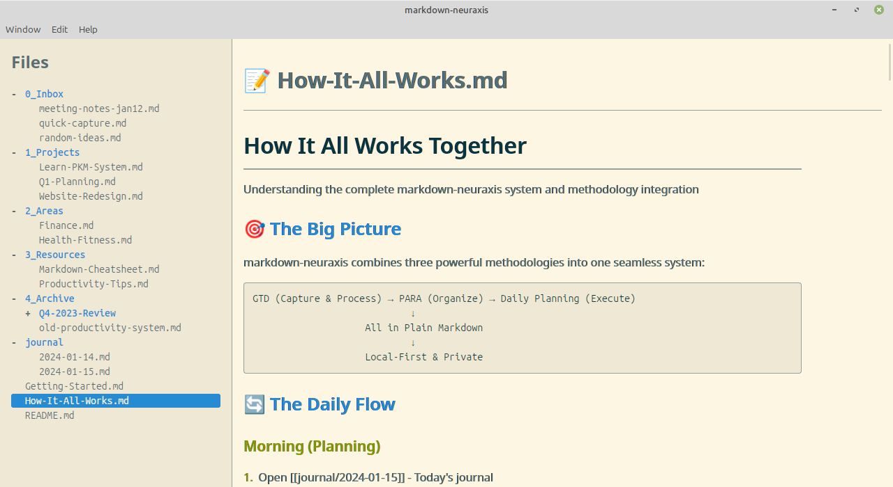

# markdown-neuraxis

**The central nervous system for your digital life, built on plain-text markdown.**

[github.com/timabell/markdown-neuraxis](https://github.com/timabell/markdown-neuraxis)

## 🧠 What is `markdown-neuraxis`?

Hi, I'm Tim. I have been trying to find the perfect system for getting organised, getting things done, and never forgetting anything important ever again. I've tried many tools and methodologies - [GTD](https://en.wikipedia.org/wiki/Getting_Things_Done), [PARA](https://fortelabs.com/blog/para/), [Sunsama](https://www.sunsama.com/), [Logseq](https://fortelabs.com/blog/para/), Trello, JIRA and so many more, and yet I find them all wanting in some way, or leaving me confused, overwhelmed, knowing I've dropped things on the floor that mattered. My journey pretty much went: plain note tools (and many abandoned lists & tools) -> [GTD+Trello](https://0x5.uk/2023/06/01/text-based-tools-the-ultimate-format-for-everything/) -> adding in Sunama daily planning -> adding in morning journalling and reflecting on a Supernote eink tablet -> adding daily notes/journals in logseq + some reference pages. Add in a separate wiki-like markdown system with vscode & markor and this is pretty much where you find me. I have not moved to a pure SaaS or closed source tool because open source local first tools seem to have less bit-rot and [enshittification](https://en.wikipedia.org/wiki/Enshittification) in the long run, and [avoid proprietary formats](https://0x5.uk/2023/06/01/text-based-tools-the-ultimate-format-for-everything/). So I'm stuck with a bunch of tools and methods that all have huge strengths, but result in a fragmented and ineffective system.

This tool is an attempt to pull everything I've learned together into one coherent tool that covers knowledge management, getting things done, daily planning, daily note taking and managing the flood of daily tasks effectively.

If you relate to the vision then star the repo and join the effort.

Note that the core tooling will be A-GPL, but may provide additional paid services where that makes sense, for example a bridge from email to the local "inbox" store.

The tool will explicitly not duplicate functionality that is already well covered by independent tools:

- File sync across machines/cloud: can be handled with syncthing, dropbox, git or many other tools

It draws inspiration from:

- 🧘 **GTD** method
- 🌅 **Sunsama** for task and daily planning with clarity of mind and focus (props to the founder for such great thinking)
- 📚 **Logseq** for outlining and journalling (engineering notebook), plus many other cool features
- 📦 **Trello** and **Kanban** for flow-based task movement - see also "The Toyota Way"
- 🧠 The **PARA** method for knowledge organization

You will get more value from this tool if you have read the GTD book, the PARA method, and have followed the Sunsama journey.

Because this tool is intended to support an opinionated methodology for handling a busy life effectively, have a read of [doc/methodology.md](doc/methodology.md) to get a feel for how the tool is intended to be used, though of course being open source software you can pretty much do whatever you like, and I'd love to hear what you use it for and how it's going.

It's all held together by:

- ✍️ Plain Markdown files
- 🧩 A fast, keyboard-driven UI (coming)
- 🧠 A mental model that connects **goals → tasks → notes** into a coherent, navigable system

## 🧬 Why the name `markdown-neuraxis`?

> In anatomy, the **neuraxis** is the structural core of the central nervous system — the literal backbone of thought and action.

In this project, your **Markdown files** form that core. They represent everything: your notes, your goals, your tasks, your daily journals, your references.

`markdown-neuraxis` is about giving you:
- A **single, fast, local** system for thinking, planning, and remembering
- A digital nervous system you **actually trust** and control
- A way to integrate daily action with lifelong purpose

## 🚧 Current Status

This is the **early groundwork** stage. Nothing promised, but something is happening.

The goal of the **first working MVP**:
- Daily journal files in Markdown
- Flat Markdown files *or* bullet-outline wiki notes
- Folder support and hierarchy
- Backlinking + page linking (`[[like this]]`)
- Keyboard-first UX
- Speed and clarity
- Tabbed window views
- Optional query syntax for dashboards (`lead-status:: contacted`, etc.)
- Migration tool from Logseq (namespace → folder)

## 🌱 Why This, Now?

All existing tools either:

- Sacrifice local control (SaaS lock-in)
- Slow down (Electron bloat)
- Miss the glue between **task**, **note**, **project**, and **life purpose**

Logseq is very good and incredibly complete, but moving to database-first and away from its roots as a markdown-first tool.

## Get involved, show your support

It will be a huge encouragement to my efforts if I know others think the same way, show your support by starring the repo (so I know you're there), adding issues and discussions, making suggestions, and posting about this in your favourite places to hang out online.

## Technology & design

See [doc/design.md](doc/design.md)

## Development

See [doc/development.md](doc/development.md) for setup instructions and development workflow.
