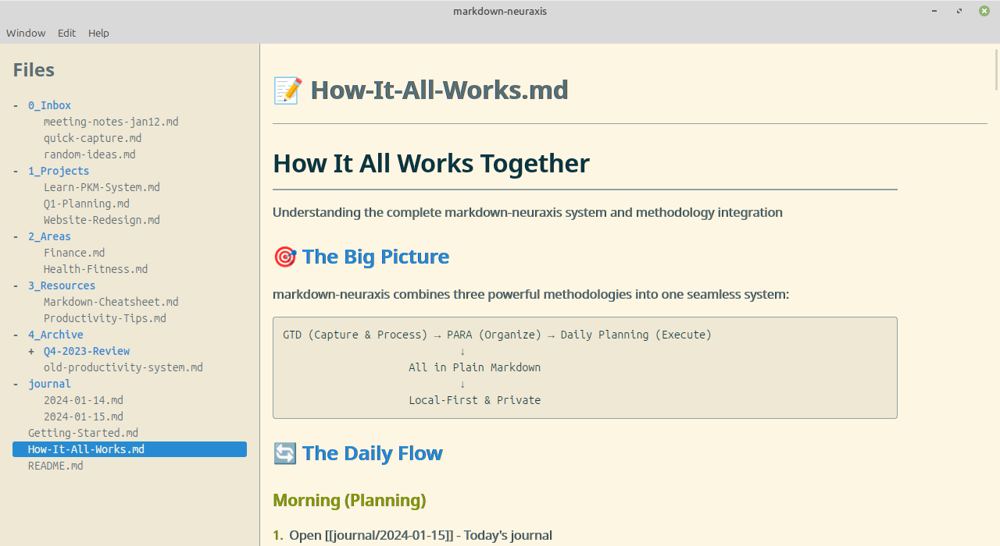

# Markdown Neuraxis (MdNX)

[github.com/timabell/markdown-neuraxis](https://github.com/timabell/markdown-neuraxis)

**The central nervous system for your digital life, built on plain-text markdown.**

⚠️⚠️ WARNING: This tool is in early development and will 100% corrupt your markdown files and possibly more. Only run this against data you have backed up, or throw-away copies for testing. There are known editing bugs that will lose markdown content due to read/write of markdown items that are not yet properly supported ⚠️⚠️



## Why markdown-neuraxis

- FOSS / Open Source - A-GPL v3 licenced
- Local-first
- Privacy-first
- Normal markdown files (with extended capabilities)
- Normal filesystem folders
- No enforced filesystem structures
- Outlining (collapsible bullets & headings)
- Support for highly nested content (e.g. code in blockquotes in deeply nested bullets)
- Fast Rust engine core
- Cross-platform
  - Desktop - Windows / Linux / Mac (with Dioxus)
  - Mobile - Android with native Kotlin UI
	- Terminal/command-line TUI (Text User Interface)

There is currently nothing out there that hits all these points. Sadly logseq is going db-first from markdown-first and the android app has stagnated and is slow; obsidian people love but is closed-source. Many markdown tools are cloud-first SaaS products.

## What will markdown-neuraxis become

- A great tool for GTD
- A guided PARA experience
- A daily journal
- Support for plugins
- A useful read-it-later tool
- Much more - I have a huge backlog of ideas for this, and would welcome all input

## Join the early community

Help shape the direction of the project, get help with making the best use of the tool, discuss with other users how to get the most out of it and stay up to date with ongoing development and changes.

1. Star this github repo
1. Join the [discord server](https://discord.gg/jTXmw8pfBA)
1. Join and follow the [github discussions](https://github.com/timabell/markdown-neuraxis/discussions)

If you'd prefer other ways of staying in touch and up to date then drop me a line and let me know.

### Contributing

All contributions greatly appreciated.

- Code: Currently the code & architecture are changing rapidly so I'd suggest starting a discussion before opening a pull request to avoid incompatibility.
- Feature ideas, bugs, suggestions etc: Please go ahead and create discussions & github issues for anything you can think off, and/or chat about it in the discord. I'm keen for this tool to be useful for more than just me, so all input greatly appreciated
- Graphic Design / UX / Interaction Design / User Research: It's not just code that will be appreciated, anything that helps make it beautiful and a great user experience will be fab.
- Writing, documentation: non-code contributions that help others understand the tool and how to use it are much appreciated
- Promotion: Please do talk about it! Spread the word.
- Plugins: there are plans to add a plugin system so ideas for what plugins might be good and what capabilities would be needed would be appreciated.

## 🧠 What is `markdown-neuraxis`?

Hi, I'm Tim. I have been trying to find the perfect system for getting organised, getting things done, and never forgetting anything important ever again. I've tried many tools and methodologies - [GTD](https://en.wikipedia.org/wiki/Getting_Things_Done), [PARA](https://fortelabs.com/blog/para/), [Sunsama](https://www.sunsama.com/), [Logseq](https://fortelabs.com/blog/para/), Trello, JIRA and so many more, and yet I find them all wanting in some way, or leaving me confused, overwhelmed, knowing I've dropped things on the floor that mattered. My journey pretty much went: plain note tools (and many abandoned lists & tools) -> [GTD+Trello](https://0x5.uk/2023/06/01/text-based-tools-the-ultimate-format-for-everything/) -> adding in Sunama daily planning -> adding in morning journalling and reflecting on a Supernote eink tablet -> adding daily notes/journals in logseq + some reference pages. Add in a separate wiki-like markdown system with vscode & markor and this is pretty much where you find me. I have not moved to a pure SaaS or closed source tool because open source local first tools seem to have less bit-rot and [enshittification](https://en.wikipedia.org/wiki/Enshittification) in the long run, and [avoid proprietary formats](https://0x5.uk/2023/06/01/text-based-tools-the-ultimate-format-for-everything/). So I'm stuck with a bunch of tools and methods that all have huge strengths, but result in a fragmented and ineffective system.

This tool is an attempt to pull everything I've learned together into one coherent tool that covers knowledge management, getting things done, daily planning, daily note taking and managing the flood of daily tasks effectively.

If you relate to the vision then star the repo and join the effort.

Note that the core tooling will be A-GPL, but may provide additional paid services where that makes sense, for example a bridge from email to the local "inbox" store.

The tool will explicitly not duplicate functionality that is already well covered by independent tools:

- File sync across machines/cloud: can be handled with syncthing, dropbox, git or many other tools

It draws inspiration from:

- 🧘 **GTD** method
- 🌅 **Sunsama** for task and daily planning with clarity of mind and focus (props to the founder for such great thinking)
- 📚 **Logseq** for outlining and journalling (engineering notebook), plus many other cool features
- 📦 **Trello** and **Kanban** for flow-based task movement - see also "The Toyota Way"
- 🧠 The **PARA** method for knowledge organization

You will get more value from this tool if you have read the GTD book, the PARA method, and have followed the Sunsama journey.

Because this tool is intended to support an opinionated methodology for handling a busy life effectively, have a read of [doc/methodology.md](doc/methodology.md) to get a feel for how the tool is intended to be used, though of course being open source software you can pretty much do whatever you like, and I'd love to hear what you use it for and how it's going.

It's all held together by:

- ✍️ Plain Markdown files
- 🧩 A fast, keyboard-driven UI (coming)
- 🧠 A mental model that connects **goals → tasks → notes** into a coherent, navigable system

## 🧬 Why the name `markdown-neuraxis`?

> In anatomy, the **neuraxis** is the structural core of the central nervous system — the literal backbone of thought and action.

In this project, your **Markdown files** form that core. They represent everything: your notes, your goals, your tasks, your daily journals, your references.

`markdown-neuraxis` is about giving you:
- A **single, fast, local** system for thinking, planning, and remembering
- A digital nervous system you **actually trust** and control
- A way to integrate daily action with lifelong purpose

## 📖 Usage

### Running the Application

The project provides multiple frontends that share the same core engine.

Pre-built binaries for all platforms are available for [download in the latest release](https://github.com/timabell/markdown-neuraxis/releases/latest).

Or you can run the app from source with `cargo`.

#### Desktop UI (Dioxus)

Pre-built:

```bash
./markdown-neuraxis-dioxus [optional-path-to-notes-folder]
```
From source

```bash
cargo run --bin markdown-neuraxis-dioxus -- [optional-path-to-notes-folder]
```

If a notes path is not provided it will prompt for a notes path and remember it in config at `~/.config/markdown-neuraxis`.

#### Terminal UI (ratatui)

Pre-built:

```bash
./markdown-neuraxis-cli <path-to-notes-folder>
```

From source

```bash
cargo run --bin markdown-neuraxis-cli -- <path-to-notes-folder>
```

#### Android App (Kotlin + Rust engine)

1. Download the latest APK from [GitHub Releases](https://github.com/timabell/markdown-neuraxis/releases/latest)
1. Enable "Install from Unknown Sources" in your Android settings
1. Install the downloaded APK (sideload)

If there is sufficient demand then I'll look at publishing to the app store(s).

You can also install it via [Obtainium](https://github.com/ImranR98/Obtainium) which pulls release apks directly from github.

### Notes Folder structure

The application works with any folder containing markdown files. However it is encouraged to follow the following layout:
```
notes/
├── journal/          # Daily journal files (YYYY_MM_DD.md)  
├── 0_Inbox/         # Universal capture folder
├── 1_Projects/      # Active projects
├── 2_Areas/         # Ongoing responsibilities
├── 3_Resources/     # Reference materials
├── 4_Archive/       # Completed/inactive items
└── assets/          # Images and other media
```

The parent folder can be called anything you like, it doesn't have to be 'notes/'

### Keyboard Shortcuts

#### File Navigation
- **↑ / ↓ / ← / →** - Navigate file tree (expand/collapse folders, select files)
- **Enter** - Open selected file for editing

#### Document Navigation
- **↑ / ↓** - Navigate between blocks (when document has focus)
- **Enter** - Start editing selected block

#### Block Editing
- **Click any block** - Start editing that block inline
- **ESC** - Save changes and exit editing mode
- **Ctrl+Enter** - Save changes and exit editing mode
- **Click elsewhere** - Save changes and exit editing mode  

#### Block Creation
- **Double newlines (`\n\n`)** during editing - Split current block into multiple blocks
- **+ button** at document end - Add new empty block and start editing

### Block-Based Editing

The editor uses a Logseq-style block-based editing system:
- Only one block is editable at a time
- All other blocks remain rendered for context
- Changes are automatically saved to disk when editing completes
- Supports all markdown block types: paragraphs, headings, lists, code blocks, quotes

## Get involved, show your support

It will be a huge encouragement to my efforts if I know others think the same way, show your support by starring the repo (so I know you're there), adding issues and discussions, making suggestions, and posting about this in your favourite places to hang out online.

## Technology & design

See [doc/design.md](doc/design.md)

## Architecture

The codebase is organized as a Rust workspace with separate crates:

- `crates/markdown-neuraxis-engine/` - Core processing logic, no UI dependencies
- `crates/markdown-neuraxis-dioxus/` - Desktop GUI using Dioxus
- `crates/markdown-neuraxis-cli/` - Terminal UI using ratatui

Both UIs share the same engine crate, providing clean separation between processing logic and presentation.

## Development

See [doc/development.md](doc/development.md) for setup instructions and development workflow.
