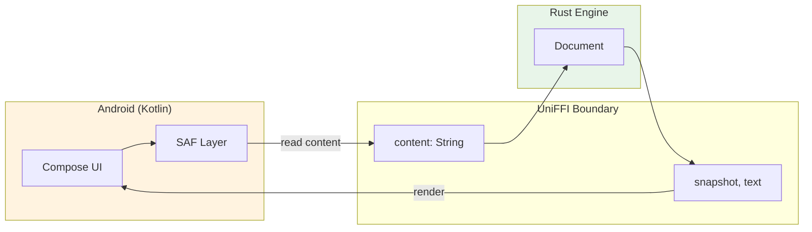

# ADR 0011: Kotlin Android Implementation Plan

## Motivating Issue

Implements [ADR-0010: Shift Android Target to Native Kotlin App](0010-android-swap-dioxus-for-kotlin.md)

## Status

Proposed

## Context

ADR-0010 established the decision to replace Dioxus-based Android with a native Kotlin app that links to the Rust core engine. This ADR provides the detailed implementation plan, including Android SDK version choices, FFI approach, project structure, and phased implementation steps.

### Current State

The codebase has:
- **`markdown-neuraxis-engine`**: Core Rust library with `editing`, `io`, and `models` modules
- **`markdown-neuraxis-dioxus`**: Desktop GUI (will remain for macOS/Windows/Linux)
- **`markdown-neuraxis-config`**: Cross-platform configuration management
- **Existing Android NDK setup**: Docker-based build environment with `cargo-ndk`
- **JNI patterns**: Storage permission code in `platform/android.rs` as reference

### Android SDK Version Decision

Based on [Android version market share data](https://telemetrydeck.com/survey/android/Android/sdkVersions/) and [Google Play requirements](https://developer.android.com/google/play/requirements/target-sdk):

| Version | API Level | Rationale |
|---------|-----------|-----------|
| **minSdkVersion** | 29 (Android 10) | Scoped storage, security updates, 98%+ device coverage |
| **targetSdkVersion** | 35 (Android 15) | Required for Play Store submission (Aug 2025 onwards) |
| **compileSdkVersion** | 36 (Android 16) | Access to latest APIs and compile-time checks |

**Why API 29 as minimum:**
- Devices below Android 10 no longer receive security updates
- Scoped storage (SAF) is properly supported from API 29
- Jetpack Compose requires API 21 minimum, but modern features work best with 29+
- Covers ~98% of active Android devices per [apilevels.com](https://apilevels.com/)

### FFI Approach: UniFFI

[UniFFI](https://github.com/mozilla/uniffi-rs) (Mozilla's multi-language bindings generator) is chosen over manual JNI:

**Advantages:**
- Auto-generates Kotlin bindings from Rust code
- Type-safe interface definitions
- Handles memory management and threading
- Used in production by Firefox, Signal, and other major apps
- Supports async functions via Kotlin coroutines

**Alternative Considered:**
- Manual JNI with `jni` crate: More verbose, error-prone, harder to maintain

### Platform I/O Architecture

#### Why Simple Content Passing Isn't Enough

An initial naive design might have the platform handle all file I/O and just pass content strings to Rust for parsing. This works for basic "open file, edit, save" but falls apart for the features a personal knowledge management tool actually needs:

| Feature | What the engine needs |
|---------|----------------------|
| Wiki links `[[file]]` | Resolve name → path, check existence, load target |
| Global search | Search content across all files |
| Backlinks | Find all files linking to current file |
| Link autocomplete | Fuzzy match against all filenames |
| Inline assets | Load images/PDFs by relative path |
| Tag queries | Find all files with specific tags |

For these features, the **Rust engine must be the "brain"** that understands the workspace structure. It needs to query and access files, not just receive content one file at a time.

#### The Callback-Based StorageProvider Pattern

Rather than Kotlin owning file knowledge and Rust being a dumb parser, we invert the relationship:

- **Rust engine** maintains the workspace model (file index, link graph, search index)
- **Platform** provides I/O primitives that Rust calls into

On Android, this means Rust calls back into Kotlin for storage operations via a UniFFI callback interface:

```kotlin
// Kotlin implements this interface, Rust calls it
interface StorageProvider {
    fun listFiles(): List<FileMetadata>  // path, mtime, size
    fun readFile(path: String): String
    fun writeFile(path: String, content: String)
    fun readBinary(path: String): ByteArray  // for assets
}

data class FileMetadata(
    val path: String,
    val lastModified: Long,
    val size: Long
)
```

UniFFI supports this pattern with `#[uniffi::export(callback_interface)]`.

#### Future Work: Caching, Workspace, and Index (Separate ADR)

The full Workspace/caching architecture described above is **deferred to a future ADR**. This ADR focuses on proving the basics work.

However, the MVP design must not paint us into a corner. Key principles to preserve:

- **Lazy startup**: Never block app launch on indexing. Show UI immediately, update index quietly in background.
- **Performance**: Lean on Rust's speed. Caching and search must be FAST. The app must feel responsive even on slow devices.
- **Memory-conscious**: Android devices are often underpowered. Keep memory usage in check.
- **Thin UI layer**: Engine should drive behavior; Kotlin UI is just rendering what the engine provides.
- **Callback pattern viable**: The StorageProvider callback approach should remain possible for when we need it.

#### MVP Architecture (This ADR)

For the MVP, we prove Rust↔Kotlin FFI works with simple content passing:



**MVP scope:**
- Kotlin handles file listing and I/O via SAF
- Rust parses/edits documents passed as content strings
- No caching, no workspace abstraction yet
- Prove: UniFFI works, tree-sitter works on Android, basic flow works

**Future scope (separate ADR):**
- StorageProvider callback interface
- Workspace with cached index
- Wiki-link resolution, search, backlinks

#### Existing Work Reference

The `android-folder-chooser` branch has an `IoProvider` trait that can evolve into `StorageProvider` when needed. The JNI-based `SafProvider` won't be ported - native Kotlin SAF is cleaner.

This supersedes the storage approach in ADR-0008 for Android.

### Tree-sitter on Android

The `markdown-neuraxis-engine` uses tree-sitter for incremental markdown parsing. Tree-sitter's Rust bindings compile natively and should work on Android, but require verification:

**Potential concerns:**
- Grammar is compiled into the binary (no dynamic loading needed) ✓
- Memory allocation patterns may differ on mobile
- First parse may have noticeable latency on lower-end devices

**Mitigation:**
- Test tree-sitter parsing on Android emulator during Phase 1
- If issues arise, investigate alternatives or simplify parsing requirements

## Decision

### Project Structure

```
markdown-neuraxis/
├── crates/
│   ├── markdown-neuraxis-engine/     # Core Rust library (unchanged)
│   ├── markdown-neuraxis-ffi/        # NEW: UniFFI bindings for mobile
│   ├── markdown-neuraxis-dioxus/     # Desktop only (remove Android)
│   ├── markdown-neuraxis-cli/        # TUI (unchanged)
│   └── markdown-neuraxis-config/     # Config (unchanged)
├── android/                          # NEW: Kotlin Android app
│   ├── app/
│   │   ├── src/main/
│   │   │   ├── java/co/rustworkshop/markdownneuraxis/
│   │   │   │   └── *.kt              # Kotlin source files
│   │   │   ├── jniLibs/              # Compiled .so files
│   │   │   │   ├── arm64-v8a/
│   │   │   │   ├── armeabi-v7a/
│   │   │   │   ├── x86/
│   │   │   │   └── x86_64/
│   │   │   └── res/                  # Android resources
│   │   ├── build.gradle.kts
│   │   └── proguard-rules.pro        # Keep UniFFI classes from obfuscation
│   ├── build.gradle.kts              # Root Gradle config
│   ├── settings.gradle.kts
│   ├── gradle.properties
│   └── gradle/wrapper/               # Gradle wrapper for reproducible builds
├── build-android.sh                  # Build script for Rust -> .so
└── docker/android/                   # Existing NDK setup
```

### UniFFI Interface Design (MVP)

The MVP FFI is minimal - just enough to prove the integration works. API will evolve.

```rust
// crates/markdown-neuraxis-ffi/src/lib.rs

uniffi::setup_scaffolding!();

/// Parse markdown and return a document handle
#[derive(uniffi::Object)]
pub struct DocumentHandle { /* wraps engine Document */ }

#[uniffi::export]
impl DocumentHandle {
    /// Create document from markdown content
    #[uniffi::constructor]
    pub fn from_string(content: String) -> Result<Self, FfiError>;

    /// Get current text content
    pub fn get_text(&self) -> String;

    /// Get rendered snapshot for UI display
    pub fn get_snapshot(&self) -> SnapshotDto;
}

// ============ DTOs ============

#[derive(uniffi::Record)]
pub struct SnapshotDto {
    pub blocks: Vec<RenderBlockDto>,
}

#[derive(uniffi::Record)]
pub struct RenderBlockDto {
    pub id: String,
    pub kind: String,
    pub depth: u32,
    pub content: String,
}

#[derive(uniffi::Error, Debug)]
pub enum FfiError {
    ParseError { message: String },
}
```

**MVP Kotlin usage:**

```kotlin
// Kotlin handles all file I/O via SAF
val content = readFileViaSaf(selectedFileUri)

// Rust parses and provides snapshot
val doc = DocumentHandle.fromString(content)
val snapshot = doc.getSnapshot()

// Render snapshot in Compose UI
snapshot.blocks.forEach { block ->
    RenderBlock(block)
}
```

**Future additions (separate ADR):**
- `StorageProvider` callback interface
- `WorkspaceHandle` with caching/indexing
- Edit commands, search, backlinks

### Error Handling Strategy

Errors cross the FFI boundary via the `FfiError` enum. Kotlin receives these as exceptions.

**Rust side:**
- All public FFI functions return `Result<T, FfiError>`
- Engine errors are mapped to appropriate `FfiError` variants
- Panics are caught by UniFFI and converted to exceptions (avoid panics in FFI code)

**Kotlin side:**
```kotlin
try {
    val doc = DocumentHandle.fromString(content)
    // use document
} catch (e: FfiException) {
    when (e) {
        is FfiException.ParseError -> showParseError(e.message)
        is FfiException.IoError -> showIoError(e.message)
        else -> showGenericError(e.message)
    }
}
```

**Async operations:** Long-running Rust operations should be called from Kotlin coroutines on `Dispatchers.IO` to avoid blocking the main thread.

## Implementation Phases (MVP)

Goal: Prove Rust↔Kotlin works. Show files, parse markdown, display content. Keep it simple.

### Phase 1: Create UniFFI Bindings Crate

**Tasks:**
1. Create `crates/markdown-neuraxis-ffi/Cargo.toml`:
   ```toml
   [package]
   name = "markdown-neuraxis-ffi"
   version.workspace = true
   edition.workspace = true

   [lib]
   crate-type = ["cdylib", "staticlib"]
   name = "markdown_neuraxis_ffi"

   [dependencies]
   markdown-neuraxis-engine = { path = "../markdown-neuraxis-engine" }
   uniffi = { version = "0.28", features = ["cli"] }
   thiserror.workspace = true

   [build-dependencies]
   uniffi = { version = "0.28", features = ["build"] }

   [[bin]]
   name = "uniffi-bindgen"
   path = "uniffi-bindgen.rs"
   ```

2. Implement MVP `DocumentHandle` wrapping engine's Document
3. Implement `SnapshotDto` and `RenderBlockDto`
4. Test on host machine first

**Deliverables:**
- FFI crate compiles
- Basic tests pass
- Generated Kotlin bindings look sane

### Phase 2: Build for Android

**Tasks:**
1. Create `build-android.sh` script:
   ```bash
   #!/bin/bash
   set -e

   # Build for Android targets (start with just arm64 for speed)
   cargo ndk -t aarch64-linux-android build --release -p markdown-neuraxis-ffi

   # Copy .so to Android jniLibs
   mkdir -p android/app/src/main/jniLibs/arm64-v8a
   cp target/aarch64-linux-android/release/libmarkdown_neuraxis_ffi.so \
      android/app/src/main/jniLibs/arm64-v8a/

   # Generate Kotlin bindings
   cargo run -p markdown-neuraxis-ffi --bin uniffi-bindgen generate \
     --library target/aarch64-linux-android/release/libmarkdown_neuraxis_ffi.so \
     --language kotlin \
     --out-dir android/app/src/main/java/co/rustworkshop/markdownneuraxis/ffi/
   ```

2. Verify tree-sitter compiles for Android target
3. Add other targets (armv7, x86, x86_64) once arm64 works

**Deliverables:**
- `.so` builds for arm64
- Kotlin bindings generated

**Note:** Docker/CI setup is future work beyond this ADR. Focus on local builds first.

### Phase 3: Create Android Studio Project

**Tasks:**
1. Initialize Kotlin project with Jetpack Compose:
   - Package: `co.rustworkshop.markdownneuraxis`
   - Min SDK: 29, Target SDK: 35, Compile SDK: 36

2. Configure `build.gradle.kts` with dependencies:
   - JNA for UniFFI runtime
   - Jetpack Compose
   - DocumentFile for SAF

3. Configure ProGuard rules to keep UniFFI classes

4. Create minimal app structure:
   - `MainActivity.kt`
   - Basic navigation

**Deliverables:**
- Android Studio project opens and builds
- App launches on emulator

### Phase 4: MVP App Features

**Features:**
1. **First run**: Prompt user for notes folder location via SAF picker, take persistent permission, remember URI for next launch
2. **File list**: Show list of .md files in selected folder
3. **View file**: Tap file → read content → pass to Rust engine → display parsed snapshot
4. **Navigation**: Android back button returns from file view to file list

**Tasks:**
1. Setup screen with SAF `OpenDocumentTree()` picker
2. Persist selected folder URI in SharedPreferences
3. On subsequent launches, skip setup if URI permission still valid
4. File list screen: enumerate .md files via `DocumentFile.listFiles()`
5. File view screen: read content via `ContentResolver`, call `DocumentHandle.fromString()`, render `getSnapshot()` blocks
6. Handle back navigation with Compose navigation or `OnBackPressedDispatcher`

**Deliverables:**
- Working app flow: setup → file list → file view → back to list
- Folder selection persists across app restarts
- Proves: UniFFI works, tree-sitter works on Android, SAF works, end-to-end flow works

### Phase 5: Clean Up Dioxus Android Support

**Tasks:**
1. Remove Android-specific code from `markdown-neuraxis-dioxus`:
   - Delete `src/platform/android.rs`
   - Remove Android feature flags
   - Update `Cargo.toml` to remove `jni`, `ndk-context` dependencies

2. Update `Dioxus.toml`:
   - Remove any Android-related configuration
   - Keep desktop platform configuration

3. Delete old Android build scripts:
   - `build-android-dx.sh` etc. (git is the archive)

4. Update documentation:
   - CLAUDE.md: Note Kotlin for Android, Dioxus for desktop

**Deliverables:**
- Dioxus crate compiles for desktop only
- Clear separation between desktop and mobile

## Android Target Architecture Summary

| Target | ABI | Use Case |
|--------|-----|----------|
| `aarch64-linux-android` | arm64-v8a | Modern phones (primary) |
| `armv7-linux-androideabi` | armeabi-v7a | Older 32-bit devices |
| `i686-linux-android` | x86 | Emulator (32-bit) |
| `x86_64-linux-android` | x86_64 | Emulator (64-bit) |

## Future Work (Beyond This ADR)

- **Workspace and caching**: StorageProvider callbacks, persistent index, incremental sync
- **Rich features**: Wiki-link resolution, search, backlinks, tag queries
- **CI/CD**: GitHub Actions, Docker builds, automated APK publishing
- **Additional targets**: armv7, x86, x86_64 (start with arm64 only)

## Consequences

### Positive
- Full access to AndroidX/Jetpack ecosystem
- Native Android UX with Compose
- Storage Access Framework works properly
- Standard Android development workflow with Android Studio
- Proves Rust↔Kotlin viability before investing in complex features

### Negative
- Two separate UI codebases (Dioxus for desktop, Compose for Android)
- UniFFI adds a thin layer between Kotlin and Rust
- Need to maintain build scripts for Rust → Android

### Risks
- **UniFFI version compatibility**: Pin UniFFI version; Kotlin output format changes between versions
- **JNA library size**: Adds ~3MB to APK; acceptable
- **Tree-sitter on Android**: Should work, verify in Phase 2

## References

- [UniFFI User Guide](https://mozilla.github.io/uniffi-rs/)
- [UniFFI Gradle Integration](https://mozilla.github.io/uniffi-rs/latest/kotlin/gradle.html)
- [Running Rust on Android with UniFFI](https://sal.dev/android/intro-rust-android-uniffi/)
- [cargo-ndk](https://github.com/nickelc/cargo-ndk)
- [Jetpack Compose](https://developer.android.com/jetpack/compose)
- [Storage Access Framework](https://developer.android.com/guide/topics/providers/document-provider)
- [Android API levels](https://apilevels.com/)
- [Google Play target SDK requirements](https://developer.android.com/google/play/requirements/target-sdk)
